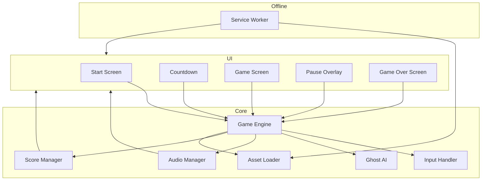

# Architect Mission Report

**Agent**: architect  
**Generated**: 2026-08-07T21:51:39.943Z

---

## Architecture Style

Single-Page Application (SPA) – offline‑first client architecture

## Components

- **StartScreen** (UI): Initial menu showing title, high‑score list and a Start button.
- **Countdown** (UI): 3‑2‑1 countdown overlay before gameplay begins.
- **GameScreen** (UI): Canvas element that renders the maze, Pac‑Man, ghosts, dots, fruit and HUD (score, lives).
- **PauseOverlay** (UI): Overlay shown when the player pauses; blocks the game loop.
- **GameOverScreen** (UI): Shows final score, high‑score entry (if applicable) and a Restart button.
- **GameEngine** (Core): Main loop (60 fps), holds the authoritative game state, updates positions, triggers rendering and sound.
- **InputHandler** (Core): Normalises keyboard, WASD, swipe and on‑screen button input into direction commands.
- **GhostAI** (Core): Implements the four distinct ghost personalities, chase/scatter timers and scared‑state logic.
- **AudioManager** (Core): Loads, plays and stops all sound effects and background siren; respects mute toggle.
- **ScoreManager** (Core): Tracks current score, lives, extra‑life thresholds and calculates points for dots, pellets, ghosts and fruit.
- **AssetLoader** (Core): Pre‑loads images, sprite sheets and audio buffers; provides them to other components on demand.
- **HighScoreStore** (Persistence): Stores the top‑10 high scores (initials + points) in IndexedDB; reads on startup and writes after Game Over.
- **ServiceWorker** (Offline): Caches all static assets (HTML, JS, CSS, images, audio) so the game works without network after first load.

## Tech Stack

- **Frontend Framework / Language**: TypeScript + Vite (no UI framework) — A plain TypeScript + Vite setup yields the smallest bundle (<2 MB) and eliminates framework overhead. React would add runtime cost and JSX parsing for a game that mainly draws on Canvas. Phaser is a full game engine; it provides many features we don't need and would increase bundle size, whereas a custom engine gives fine‑grained control over performance.
- **Rendering**: HTML5 Canvas 2D — Canvas 2D is the classic, low‑latency way to render pixel‑art games at 60 fps and fits the 2D grid nature of Pac‑Man. WebGL is unnecessary complexity for a simple 2D raster game and would increase development time. SVG is resolution‑independent but far slower for per‑frame updates of many sprites.
- **Audio**: Web Audio API (native) — Web Audio API gives precise timing, low latency and easy volume/panning control, essential for the classic "waka‑waka" effect. <audio> elements suffer from latency and limited control. Howler.js wraps Web Audio but adds extra kilobytes; using the native API keeps the bundle minimal.
- **Build / Bundling**: Vite (esbuild under the hood) — Vite provides instant dev server start, fast HMR and produces highly optimized production bundles with esbuild, keeping the final size under the 2 MB limit. Webpack is more configurable but slower and adds configuration overhead. Parcel is zero‑config but its bundle optimizer is less aggressive than Vite's for this size‑constrained project.
- **Testing**: Jest (unit) + Playwright (e2e) — Jest offers a rich mocking API and runs fast in CI; Playwright supports cross‑browser end‑to‑end tests (Chrome, Firefox, Safari) which matches the target browsers. Mocha lacks built‑in mocking and snapshot support. Cypress is great but runs only in Chromium‑based browsers and adds a larger runtime footprint.
- **CI/CD**: GitHub Actions — The repository is assumed to be hosted on GitHub; Actions integrates directly, provides free minutes for open‑source, and can run lint, test, build and deploy to GitHub Pages. GitLab CI would require moving the repo; CircleCI adds external service complexity.
- **Offline / Caching**: Workbox (via Service Worker) — Workbox abstracts common caching patterns (precache manifest, runtime caching) and generates a reliable Service Worker with minimal code, reducing bugs. Writing a custom Service Worker is error‑prone for cache versioning. SWPrecache is deprecated in favor of Workbox.
- **Persistence (High Scores)**: IndexedDB via idb library — IndexedDB handles structured data and larger payloads without size limits that localStorage imposes (5 MB) and works asynchronously, avoiding UI jank. localStorage is synchronous and can block the main thread. WebSQL is deprecated and not supported in all browsers.
- **State Management**: Custom lightweight store (RxJS‑style observable) — The game has a single source of truth (GameEngine) and only a few subscribers (UI, Audio, Score). A tiny custom observable avoids extra library weight. Redux adds boilerplate and bundle size; Zustand is small but still an extra dependency not needed for this simple flow.

## Epics

- **E1** Core Game Loop & Rendering: Implement the 60 fps requestAnimationFrame loop, maintain the authoritative game state, and draw the maze, Pac‑Man, ghosts, dots, pellets, fruit and HUD on an HTML5 Canvas.
- **E2** Player Input System: Support keyboard (arrow keys / WASD), on‑screen directional buttons and swipe gestures; translate them into direction commands for the GameEngine.
- **E3** Ghost AI Behaviors: Create four distinct ghost personalities (chase, ambush, flank, random), implement chase/scatter timer, scared state reversal, speed changes and eye‑return logic.
- **E4** Scoring, Lives & Level Progression: Track points for dots, pellets, ghosts and fruit, manage extra‑life at 10 000 points, handle life loss, level completion detection and difficulty scaling (ghost speed, scatter/chase ratios, scared time).
- **E5** Audio System: Load and play all sound effects and the looping background siren; adjust pitch/speed as level progresses; provide mute/unmute toggle.
- **E6** User Interface Screens: Build Start Screen, Countdown, Pause Overlay, Level‑Complete transition and Game Over screen with high‑score entry.
- **E7** Offline Support & Asset Caching: Cache all static assets (HTML, JS, CSS, images, audio) on first load so the game can be launched without network connectivity.
- **E8** High Score Persistence: Store the top‑10 scores (initials + points) in IndexedDB, load them on startup, and update the list after Game Over when a new score qualifies.
- **E9** Accessibility & Color‑Blind Mode: Ensure full keyboard navigation for all menus, visible focus outlines, and provide a toggle that swaps ghost colors to a palette safe for common color‑vision deficiencies.
- **E10** Responsive Design & Mobile Controls: Make the canvas and UI scale from 375 px to 2560 px, add on‑screen directional buttons for touch devices, and ensure swipe gestures work reliably.

## Architecture Diagram

