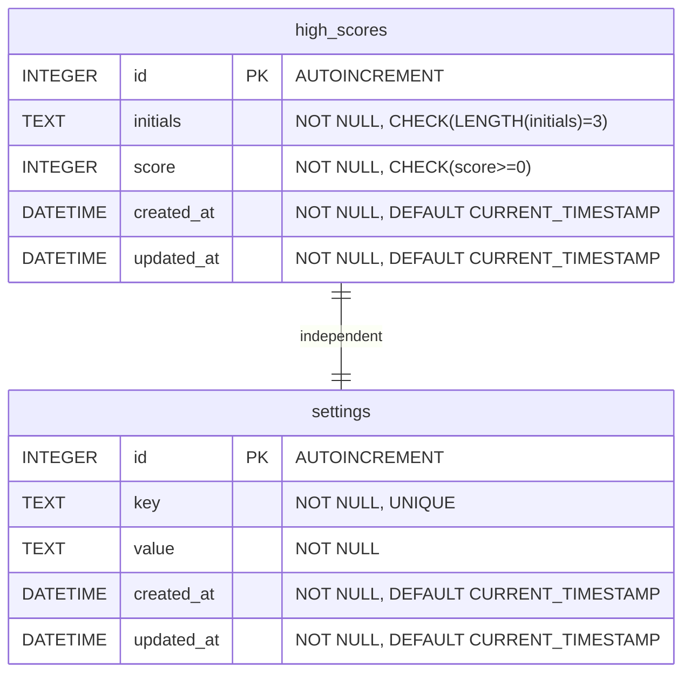

# DBA Mission Report

**Agent**: dba  
**Generated**: 2026-08-07T21:52:39.686Z

---

## Database Engine: IndexedDB (via idb library)

The game runs entirely in the browser and must work offline after the first load. IndexedDB provides asynchronous, structured storage with virtually unlimited size, making it ideal for persisting the top‑10 high scores and optional user settings without requiring a server. The idb wrapper gives a promise‑based API that integrates cleanly with TypeScript.

## Entities (2)

- **high_scores**: 5 columns
- **settings**: 5 columns

## ERD

